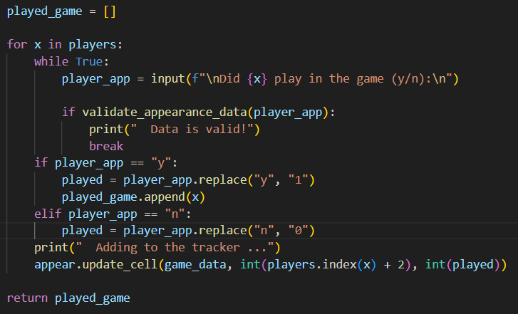
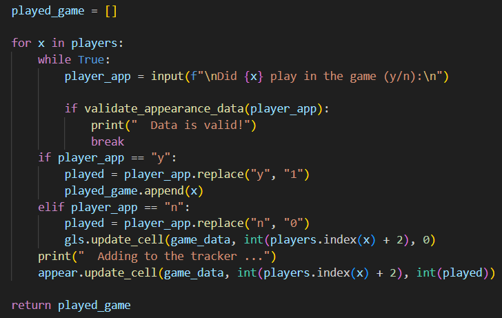
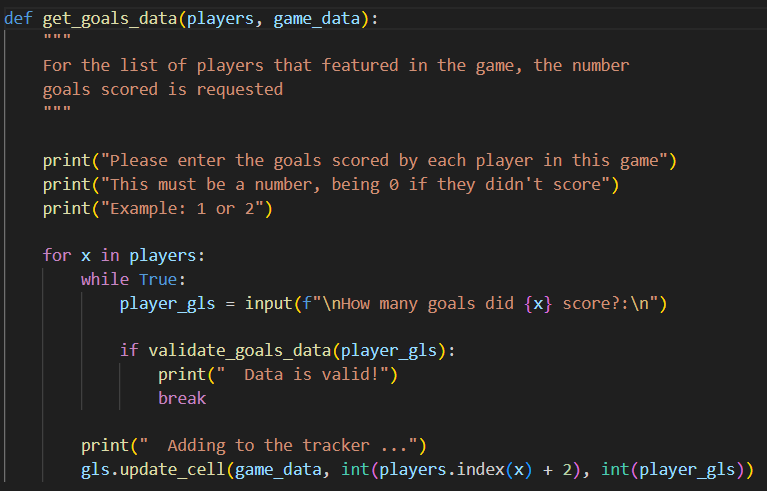
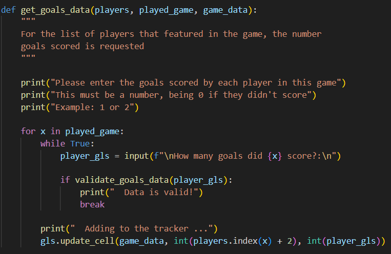

---

A Program for recorded and reviewing football Statistics for the Everett Rovers U9 Yellow team

My son (Seth) plays for a football team called Everett Rovers U9. I am tasked with analysing team performance and tracking our statistics. This project is aimed at automated input and analysis of this team for the purposes of providing actionable insights.

## User Stories

 - As a user I want to be able to store the statistics of my son's football team, so that I can track the performance of the team through the season

 - As a user I want to store appearance data for each player, so that I can see how frequently this player is attending matches and understand how the team has performed when this player is in the line up

 - As a user I want to store goal data for each player, so that I can understand how regularly this player is scoring and their contribution to the team

 - As a user I want to store goal against data for each match, so that I can understand the match result and see the contribuion of those boys playing when agoal is conceded

 - As a user I want to be able to run reports on the data, so that I can access and track the team's overall performance and individual player data

 - As a user I want a report that shows me the best team for the next match, based on form statistics, so that I can have a data based and objective way to select the players

## Features

### Main Interface Area

The project uses a command line interface:

It begins with a welcome message and a menu for the user to choose

The menu gives access to #1 a "Games Report, showing the teams results:

The menu also gives access to #2 a "Goals Report, showing the teams scoring & conceding record:

A user also has access to #3 a "Top scorer" Report, showing the who has got the most goals this season:

Finally a user can also input new match data, using option #4:

The project data is stored in a google sheet:

## Technical Diagram

The logic and technical workflow was designed in advance (using Miro), ensuring a sound game play flow:

---
## Technologies Used

- [Pyton](https://www.python.org/) - was used to add the technical logic of the project.
- [Google Sheets](https://docs.google.com/spreadsheets/) - was used to store the project data.
- [Miro](https://miro.com/templates/diagrams/) was used to sketch the technical diagram.
- [VSCode](https://code.visualstudio.com/) was used as the main tool to write and edit code.
- [Git](https://git-scm.com/) was used for the version control of the website.
- [GitHub](https://github.com/) was used to host the code of the website.
- [Heroku]() was used to deploy the project.

---
## Design

## Wireframes

The basic structure of the website was created using Balsamiq:
[here]()

## Testing

In order to confirm the correct functionality, responsiveness, and appearance:

+ The website was tested on the following browsers: Chrome, Firefox, Brave.

+ The website was checked with 

    - Desktop Screens: [here]()

    - Tablet Screens: [here]()

    - Mobile Screens: [here]()

+ TBC

### Manual testing

| feature | action | expected result | tested | passed | comments |
| --- | --- | --- | --- | --- | --- |
| Game Play | | | | | |
| Initial Game State | Refresh page and review set up | All cards are shown face down, a bankroll of 100 & scores at 0 | Yes | Yes | - |
| Stake not set | No entry is made in the stake box, but "Deal" button pressed  | A message appears showing the user that they can't bet nothing and a new deal is offered | Yes | Yes | - |
| Stake greater than Bankroll | Player chooses a stake higher than the Bankroll available  | A message appears showing the user that they can't bet this amount and a new deal is offered | Yes | Yes | - |
| Initial Deal | Enter a valid stake and click on the "Deal" button | The player receives 2 cards, the correct total is shown on the player score and the Hit/Stand choice is offered | Yes | Yes | - |
| Player chooses "Hit" |The "Hit" button is clicked |The player receives a third card, the correct total is calcuated and the house is dealt its cards |Yes |Yes | |
| Player chooses "Stand" and Busts |The "Stand" button is clicked |The player does not receive a third card, the result of the game is calculated as a loss, with the house cards not shown |Yes |Yes | |
| Player chooses "Stand" and scores 21 or lower |The "Stand" button is clicked |The player does not receive a third card, the house hand is dealt correctly, the game result is calculated correctly |Yes |Yes | |
| Hand result is calculated correctly |The hand is concluded after "Hit" or "Stand" |The player score is shown correctly, the house score is show correctly, a win or lose message is displayed correctly |Yes |Yes | |
| Hand outcome of a win is shown correctly |A hand is concluded |The Bankroll is updated to reflect the win, in line with the bet amount |Yes |Yes | |
| Hand outcome of a loss is shown correctly |A hand is concluded |The Bankroll is updated to reflect the loss, in line with the bet amount |Yes |Yes | |
| Game outcome of a win is shown correctly |The player reaches a bankroll of 200 or greater after as many hands as necessary |A congratulations message is shown, a celebration sound is played, the user is offered a restart option |Yes |Yes | |
| Game outcome of a loss is shown correctly |The player reaches a bankroll of 0 after as many hands as necessary |A commiseration message is shown, a commiseration sound is played, the user is offered a restart option |Yes |Yes | |
| Modal | | | | | |
| Game rules are shown  |The "i" button is clicked | The rules of the game are shown to the player |Yes |Yes | |
| Game rules are hidden |The screen is clicked when the modal is open | The rules of the game are no longer shown to the player and the game is playable |Yes |Yes | |
| Sound | | | | | |
| Sound plays  |The sound toggle is clicked on | Sounds play when hands are won or lost |Yes |Yes | |
| Sound does not play |The sound toggle is left off  | Sounds do not play when hands are won or lost |Yes |Yes | |
| Footer | | | | | |
| Github icon in the footer | Click on the Github icon | The user is redirected to the Github page | Yes | Yes | - |

---
### Bugs
+ ##### Solved bugs
    1.  Inially the input feature would ask for whether, this was because it used the full "players" list to cycle through

    
    
    Solutions: A separate "played_game" variable was created when
    
    
    ---

    2.  When inputting the goals for those that played in the match, those that didn't had no date in the gspread. This would cause an error in the get_gls calculation, since a "" string is created in the relevant lists.

    
    
    Solutions: a separate gspread update was introduced to insert "0 goals" for all those not playing in the match

    
    ---
+ ##### Unsolved bugs
    - None

+ ##### Mistakes
    - None

---
## Deployment

- The site was deployed to Heroku, and can be accessed [here](https://everett-rovers-u9y-15b7dda34125.herokuapp.com/). 

The steps to deploy are as follows:
  - In an [Heroku](https://dashboard.heroku.com/apps) account, navigate to the "create app option"

  

  - In the settings tab, update the "config variables" with the following CRED / PORTs. This includes the contents of the creds.json file (not on GiHub).

  

  - Then link the GitHub repo (https://github.com/t0bes1/football-stats) and "enable" automatic deploys:

  

  - From the source section drop-down menu, select the **Main** Branch and click "Deploy Branch":

  

  - The page will be automatically updated when commits and pushed to the GitHub repo.

---
## Credits

+ #### Content

  - All content has been created personally
---

## Acknowledgments

- [Code Institute](https://codeinstitute.net/) tutors and Slack community members for their support and help.

---