---
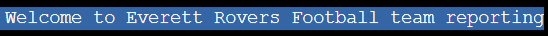

A Program for recording and reviewing football Statistics for the Everett Rovers U9 Yellow team:

My son (Seth) plays for a football team called Everett Rovers U9. I am tasked with analysing team performance and tracking our statistics. This project is aimed at automating input and analysis of this data for the purposes of providing actionable insights and easy review of performance.

The program can be accessed [here](https://everett-rovers-u9y-15b7dda34125.herokuapp.com/) through any web browser.


## User Stories

 - As a user I want to be able to store the statistics of my son's football team, so that I can track the performance of the team through the season

 - As a user I want to store appearance data for each player, so that I can see how frequently this player is attending matches and understand how the team has performed when this player is in the line up

 - As a user I want to store goal data for each player, so that I can understand how regularly this player is scoring and their contribution to the team

 - As a user I want to store goal against data for each match, so that I can understand the match result and see the contribuion of those boys playing when agoal is conceded

 - As a user I want to be able to run reports on the data, so that I can access and track the team's overall performance and individual player data

 - As a user I want a report that shows the best player for the next match, based on form statistics, so that I can have a data based and objective way to select the next match captain


## Features

### Main Interface Area

The project uses a command line interface:

It begins with a welcome message and a menu for the user to choose

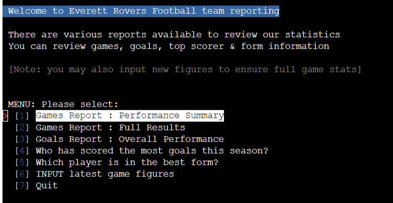

The menu gives access to #1 a "Games Report summary", showing the headline teams results:

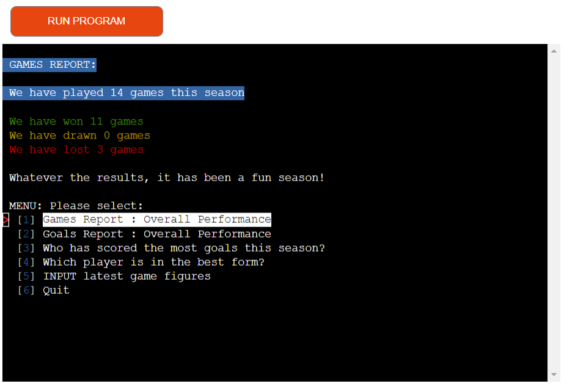

Then there is access to #2 a "Games Report Full", showing all the teams results:

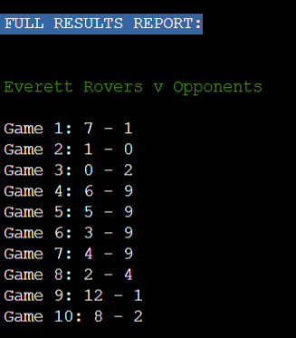

The menu also gives access to #3 a "Goals Report, showing the teams scoring & conceding record:

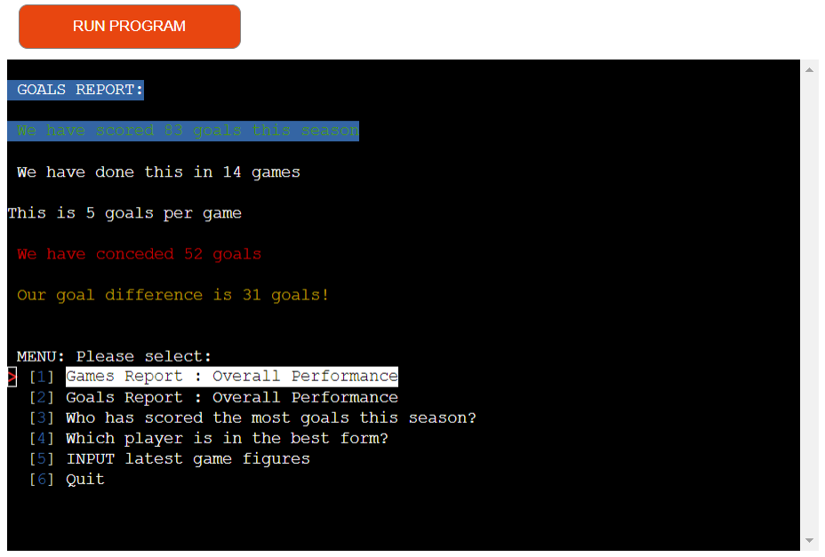

A user also has access to #4 a "Top scorer" Report, showing the who has got the most goals this season:

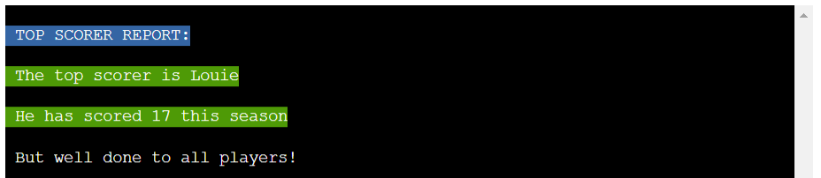

A user also has access to #5 a "Form" Report, showing who is playing best this season


Finally a user can also input new match data (appearances, goals, conceded goals), using option #6:

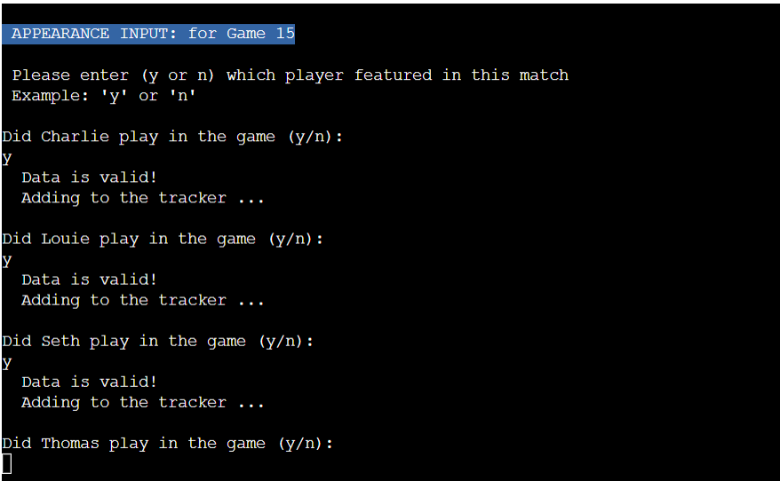

The project data is stored in a google sheet (3 tabs):

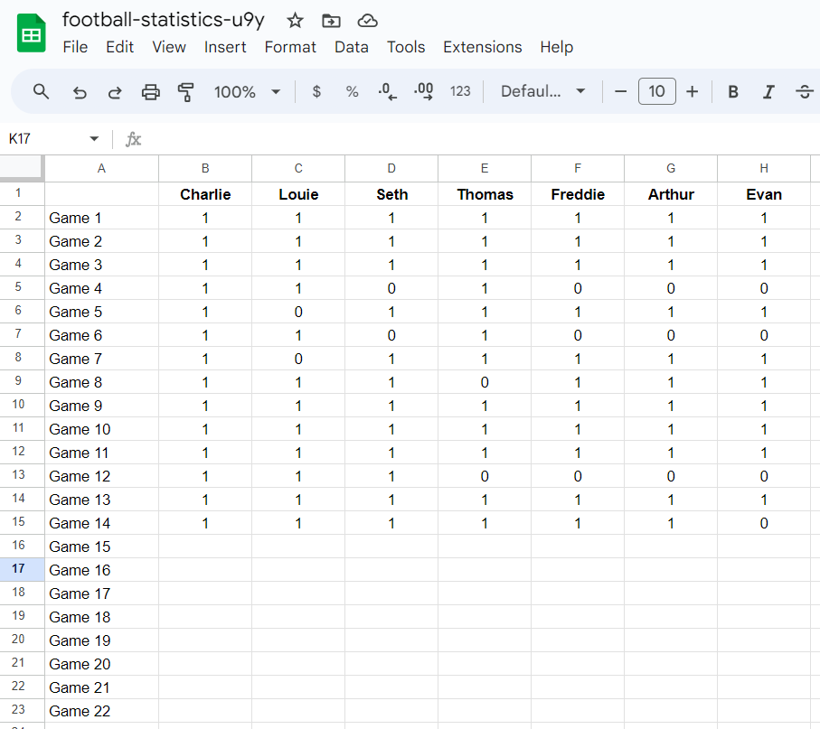


## Technical Diagram

The logic and technical workflow was designed in advance (using Miro), ensuring a sound program user experience flow:

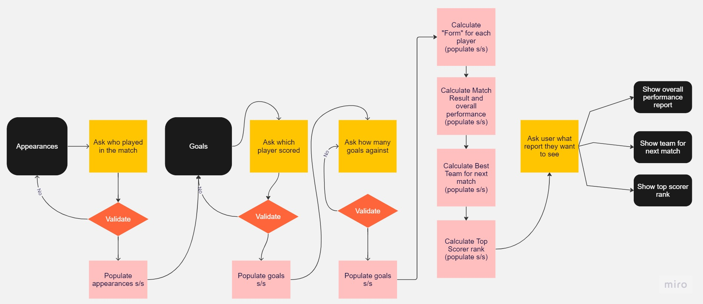

---
## Technologies Used

### Languages:

- [Python 3.8.5](https://www.python.org/downloads/release/python-385/): used to anchor the project and direct all application behaviour

- [JavaScript](https://www.javascript.com/): used to provide the start script needed to run the Code Institute mock terminal in the browser

- [HTML](https://developer.mozilla.org/en-US/docs/Web/HTML) used to construct the elements involved in building the mock terminal in the browser

### Frameworks/Libraries, Programmes and Tools:
#### Python modules/packages:

##### Standard library imports:
- [time](https://docs.python.org/3/library/time.html) was used to create short delays to aid user experience.
- [os](https://docs.python.org/3/library/os.html ) was used to clear the terminal before running the program.

##### Third-party imports:
- [Gspread](https://docs.gspread.org/en/v5.10.0/) was used to access and transfer the project data.
- [Simple Terminal Menu](https://pypi.org/project/simple-term-menu/) was used to implement the menu.
- [Colorama](https://pypi.org/project/colorama/) was used to add colors and styles to the project.

#### Other tools:
- [VSCode](https://code.visualstudio.com/) was used as the main tool to write and edit code.
- [Google Sheets](https://docs.google.com/spreadsheets/) was used to store the project data.
- [Git](https://git-scm.com/) was used for the version control of the website.
- [GitHub](https://github.com/) was used to host the code of the website.
- [Miro](https://miro.com/) was used to make a flowchart for the README file.
- [Heroku](https://dashboard.heroku.com/apps) was used to deploy the project.

---
## Design

The Command Line UI was enhanced with various colours, using a Python library [Colorama](https://pypi.org/project/colorama/)

## Testing

In order to confirm the correct functionality, responsiveness, and appearance:

+ The website was checked with Chrome, Safari & Firefox on the following devices:

    - Desktop Screens: [here](documentation/desktop-designcheck.png)

    - Tablet Screens: [here](documentation/tablet-designcheck.png)

    - Mobile Screens (landscape mode): [here](documentation/mobile-designcheck.png)

### Manual testing

The program has been tested with multiple (x4) people, including children(x2) to ensure the UI is intuitive and all errors are captured. There are no inputs that result in the program crashing and no "dead ends".

The below represents all paths tested by all users:


| feature | action | expected result | tested | passed | comments |
| --- | --- | --- | --- | --- | --- |
| Inital program state |Clicking "Run Program" in the browers | Data processed, "Welcome" message shows & Menu appears |Yes |Yes | |
| Menu 1: Games Summary Report |Data shows as expected (in line with base gspread numbers) | | Yes | Yes | - |
| Menu 2: Games Full Report |Data & messaging shows as expected (in line with base gspread numbers) | | Yes | Yes | - |
| Menu 3: Goals Report |Data & messaging shows as expected (in line with base gspread numbers) | | Yes | Yes | - |
| Menu 4: Top Scorer Report |Data & messaging shows as expected (in line with base gspread numbers) | | Yes | Yes | - |
| Menu 5: Form Report |Data & messaging shows as expected (in line with base gspread numbers) | | Yes | Yes | - |
| Menu 7: Quit |Program ends| | Yes | Yes | - |
| Menu 6: Input data - happy path, no errors in input |Game, Appearance & Goal data processed and refreshed| | Yes | Yes | - |
| Menu 6: Reports run again (after happy path) |All reports show updated data (per gspread) and messaging remains| | Yes | Yes | - |
| Menu 6: Input data - game data error - string |Correct invalid message returned, data requested again| | Yes | Yes | - |
| Menu 6: Input data - game data error - number out of range |Correct invalid message returned, data requested again| | Yes | Yes | - |
| Menu 6: Input data - game data error - no entry |Correct invalid message returned, data requested again| | Yes | Yes | - |
| Menu 6: Input data - appearance error - incorrect string or number |Correct invalid message returned, data requested again| | Yes | Yes | - |
| Menu 6: Input data - appearance error - no entry |Correct invalid message returned, data requested again| | Yes | Yes | - |
| Menu 6: Input data - goal error - incorrect string or number |Correct invalid message returned, data requested again| | Yes | Yes | - |
| Menu 6: Input data - goal error - no entry |Correct invalid message returned, data requested again| | Yes | Yes | - |
| Menu 6: Input data - conceded error - incorrect string or number |Correct invalid message returned, data requested again| | Yes | Yes | - |
| Menu 6: Input data - conceded error - no entry |Correct invalid message returned, data requested again| | Yes | Yes | - |

---
## Validation

The code for the program has been run through the "Code Instiute" Python Linter to check for errors: NONE found.

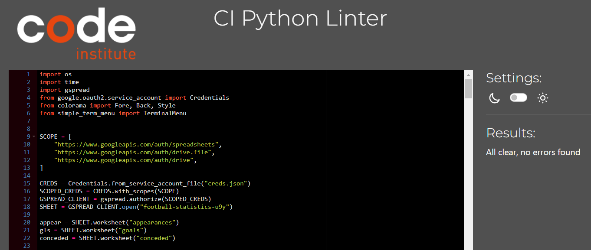

---
### Bugs
+ ##### Solved bugs
    1.  The input data request ```get_goals_data``` would ask for the goals scored in the match by players that did not play in the game, as it used the full "player" list

     Solution: I created a "played_game" list as part of the ```get_appearance_data``` data function. This was instead called by the ```get_goals_data``` function to ask about whether a player scored in the match

    ```python
    played_game = []
    for player in players:
        while True:
            player_app = input(f" Did {FY}{player}{R} play the match?(y/n):\n")
            if validate_appearance_data(player_app):
                print("\n  Data is valid!")
                break
        if player_app == "y":
            played = player_app.replace("y", "1")
            played_game.append(player)
        elif player_app == "n":
            played = player_app.replace("n", "0")
            gls.update_cell(game_data, int(players.index(player) + 2), 0)
        print("  Adding to the tracker ...\n")
        app.update_cell(game_data, int(players.index(player) + 2), int(played))

    return played_game
  ```
    
    2.  When inputting the goals for those that played in the match, those that didn't had no data. This would cause an error in the ```get_gls``` calculation, since a "" string is created in the relevant lists.
    
    Solution: a separate gspread update was introduced in ```get_appearance_data``` to insert "0 goals" for all those not playing in the match

    ```python
    elif player_app == "n":
            played = player_app.replace("n", "0")
            gls.update_cell(game_data, int(players.index(player) + 2), 0)
    ```

    3.  When inputting goals, values > 5 were being accepted by the ```validate_goals_data``` check. Whilst it is technically possible to score infinite (!) goals in a football match, large goals numbers are more likely to be a user input error.

    Solution: As such, a soft reminder / warning was introduced in ```validate_goals_data``` for users to flag that a high goal number had been received, which prompts them to edit this input in future, if it has indeed been done in error.

    ```python
    try:
        if int(data_gls) > 5:
            print(
                Back.YELLOW
                + f"""This number "{data_gls}" is possible but very high
                \nPlease adjust figures later if an error has been made\n{R}"""
            )
            return True
        elif int(data_gls) < 0:
            raise ValueError(Back.RED + f"Goals must be a positive number")
    except ValueError as e:
        print(Back.RED + f"""\nInvalid data: {e},please try again.\n{R}""")
        return False

    return True
  ```

+ ##### Unsolved bugs
    - None

+ ##### Mistakes
    - None

---
## Deployment

- The site was deployed to Heroku, and can be accessed [here](https://everett-rovers-u9y-15b7dda34125.herokuapp.com/).

### To deploy the project as an application that can be **run locally**:

*Note:*
  1. This project requires you to have Python installed on your local PC:
  - `sudo apt install python3`

  1. You will also need pip installed to allow the installation of modules the application uses.
  - `sudo apt install python3-pip`

Create a local copy of the GitHub repository by following one of the two processes below:

- Download ZIP file:
  1. Go to the [GitHub Repo page](https://github.com/t0bes1/football-stats).
  1. Click the Code button and download the ZIP file containing the project.
  1. Extract the ZIP file to a location on your PC.

- Clone the repository:
  1. Open a folder on your computer with the terminal.
  1. Run the following command
  - `git clone https://github.com/t0bes1/football-stats.git`


### To deploy the project to Heroku so it can be run as a remote web application:

- Clone the repository:
  1. Open a folder on your computer with the terminal.
  1. Run the following command
  - `gh repo clone t0bes1/football-stats`

  1. Create your own GitHub repository to host the code.
  1. Run the command `git remote set-url origin <Your GitHub Repo Path>` to set the remote repository location to your repository.

  1. Push the files to your repository with the following command:
  `git push`

  1. Create a Heroku account if you don't already have one here [Heroku](https://dashboard.heroku.com).

  1. Go to [Heroku](https://dashboard.heroku.com/apps) account, navigate to the "create app option"

  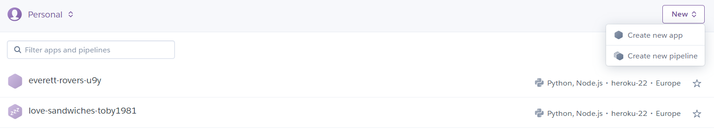

  1. In the settings tab, update the "config variables" with the following CRED / PORTs. This includes the contents of the creds.json file (not on GiHub).

  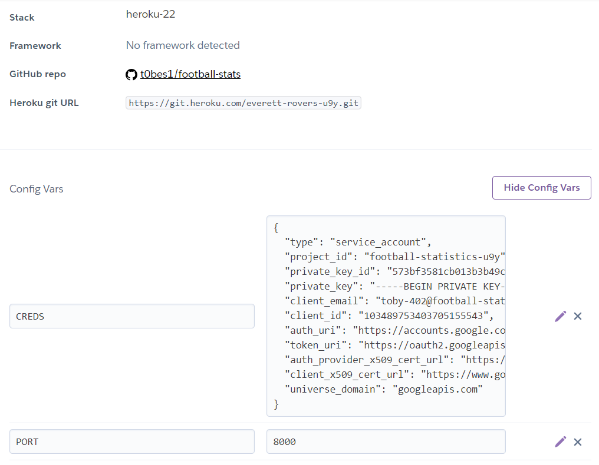

  1. Then link the GitHub repo (https://github.com/t0bes1/football-stats) and "enable" automatic deploys:

  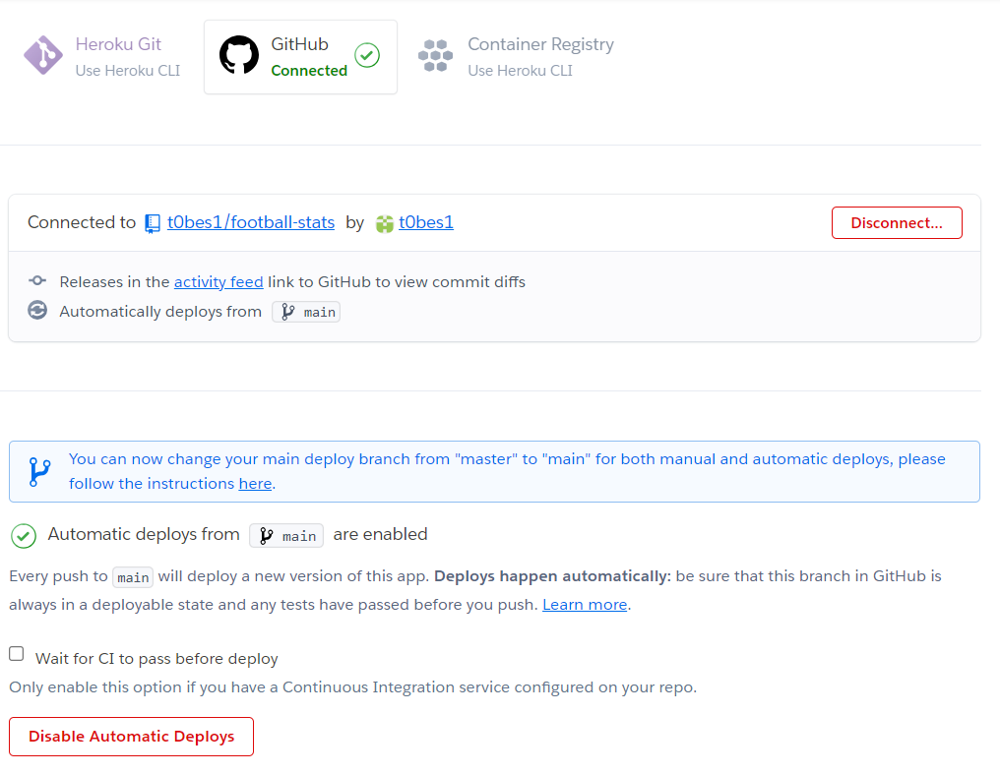

  1. From the source section drop-down menu, select the **Main** Branch and click "Deploy Branch":

  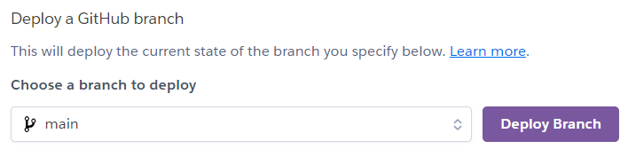

  1. The page will be automatically updated when commits are pushed to the GitHub repo.

---
## Credits

+ #### Content

  - All content (like player names) are from my son's real team at [Everett Rovers Football Club](https://www.everettroversfc.co.uk/)
  - Color formatting: [Colorama](https://pypi.org/project/colorama/).
  - Terminal menu: [Simple Terminal Menu](https://pypi.org/project/simple-term-menu/).
  - Data storage: [Google Sheets](https://docs.google.com/spreadsheets/u/0/)
---

## Acknowledgments

- [Code Institute](https://codeinstitute.net/) tutors and Slack community members for their support and help.
---