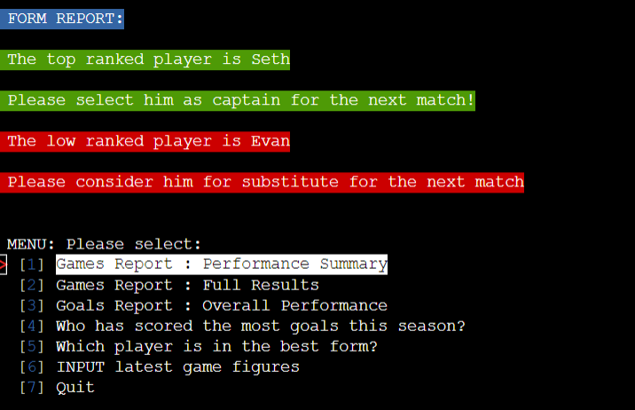

---

A Program for recording and reviewing football Statistics for the Everett Rovers U9 Yellow team:

My son (Seth) plays for a football team called Everett Rovers U9. I am tasked with analysing team performance and tracking our statistics. This project is aimed at automating input and analysis of this data for the purposes of providing actionable insights and easy review of performance.

The program can be accessed [here](https://everett-rovers-u9y-15b7dda34125.herokuapp.com/) through any web browser.

## User Stories

 - As a user I want to be able to store the statistics of my son's football team, so that I can track the performance of the team through the season

 - As a user I want to store appearance data for each player, so that I can see how frequently this player is attending matches and understand how the team has performed when this player is in the line up

 - As a user I want to store goal data for each player, so that I can understand how regularly this player is scoring and their contribution to the team

 - As a user I want to store goal against data for each match, so that I can understand the match result and see the contribuion of those boys playing when agoal is conceded

 - As a user I want to be able to run reports on the data, so that I can access and track the team's overall performance and individual player data

 - As a user I want a report that shows the best player for the next match, based on form statistics, so that I can have a data based and objective way to select the next match captain

## Features

### Main Interface Area

The project uses a command line interface:

It begins with a welcome message and a menu for the user to choose

The menu gives access to #1 a "Games Report summary", showing the headline teams results:

Then there is access to #2 a "Games Report Full", showing all the teams results:

The menu also gives access to #3 a "Goals Report, showing the teams scoring & conceding record:

A user also has access to #4 a "Top scorer" Report, showing the who has got the most goals this season:

A user also has access to #5 a "Form" Report, showing who is playing best this season

Finally a user can also input new match data (appearances, goals, conceded goals), using option #6:

The project data is stored in a google sheet (3 tabs):

## Technical Diagram

The logic and technical workflow was designed in advance (using Miro), ensuring a sound program user experience flow:

---
## Technologies Used

- [Pyton](https://www.python.org/) was used to code the technical logic of the project.
- [Google Sheets](https://docs.google.com/spreadsheets/) was used to store the project data.
- [Miro](https://miro.com/templates/diagrams/) was used to sketch the technical diagram.
- [VSCode](https://code.visualstudio.com/) was used as the main tool to write and edit code.
- [Git](https://git-scm.com/) was used for the version control of the website.
- [GitHub](https://github.com/) was used to host the code of the website.
- [Heroku](https://dashboard.heroku.com/) was used to deploy the project (using also node.js).

The following Python projects were used to add additional functionality:
- [gspread](https://docs.gspread.org/en/latest/) to access the Google sheets data store via an API
- [simple term menu](https://pypi.org/project/simple-term-menu/0.4.4/) to allow the main program menu to be created 

The "os" and "time" libraries were also used for adding simple UX features

---
## Design

The Command Line UI was enhanced with various colours, using a Python library [Colorama](https://pypi.org/project/colorama/)

## Testing

In order to confirm the correct functionality, responsiveness, and appearance:

+ The website was checked with Chrome, Safari & Firefox on the following devices:

    - Desktop Screens: [here](documentation/desktop-designcheck.png)

    - Tablet Screens: [here](documentation/tablet-designcheck.png)

    - Mobile Screens (landscape mode): [here](documentation/mobile-designcheck.png)

### Manual testing

The program has been tested with multiple (x4) people, including children(x2) to ensure the UI is intuitive and all errors are captured. There are no inputs that result in the program crashing and no "dead ends".

The below represents all paths tested by all users:

| feature | action | expected result | tested | passed | comments |
| --- | --- | --- | --- | --- | --- |
| Inital program state |Clicking "Run Program" in the browers | Data processed, "Welcome" message shows & Menu appears |Yes |Yes | |
| Menu 1: Games Summary Report |Data shows as expected (in line with base gspread numbers) | | Yes | Yes | - |
| Menu 2: Games Full Report |Data & messaging shows as expected (in line with base gspread numbers) | | Yes | Yes | - |
| Menu 3: Goals Report |Data & messaging shows as expected (in line with base gspread numbers) | | Yes | Yes | - |
| Menu 4: Top Scorer Report |Data & messaging shows as expected (in line with base gspread numbers) | | Yes | Yes | - |
| Menu 5: Form Report |Data & messaging shows as expected (in line with base gspread numbers) | | Yes | Yes | - |
| Menu 7: Quit |Program ends| | Yes | Yes | - |
| Menu 6: Input data - happy path, no errors in input |Game, Appearance & Goal data processed and refreshed| | Yes | Yes | - |
| Menu 6: Reports run again (after happy path) |All reports show updated data (per gspread) and messaging remains| | Yes | Yes | - |
| Menu 6: Input data - game data error - string |Correct invalid message returned, data requested again| | Yes | Yes | - |
| Menu 6: Input data - game data error - number out of range |Correct invalid message returned, data requested again| | Yes | Yes | - |
| Menu 6: Input data - game data error - no entry |Correct invalid message returned, data requested again| | Yes | Yes | - |
| Menu 6: Input data - appearance error - incorrect string or number |Correct invalid message returned, data requested again| | Yes | Yes | - |
| Menu 6: Input data - appearance error - no entry |Correct invalid message returned, data requested again| | Yes | Yes | - |
| Menu 6: Input data - goal error - incorrect string or number |Correct invalid message returned, data requested again| | Yes | Yes | - |
| Menu 6: Input data - goal error - no entry |Correct invalid message returned, data requested again| | Yes | Yes | - |
| Menu 6: Input data - conceded error - incorrect string or number |Correct invalid message returned, data requested again| | Yes | Yes | - |
| Menu 6: Input data - conceded error - no entry |Correct invalid message returned, data requested again| | Yes | Yes | - |

---
### Bugs
+ ##### Solved bugs
    1.  Inially the input feature would ask for whether, this was because it used the full "players" list to cycle through

    
    
    Solutions: A separate "played_game" variable was created when
    
    
    ---

    2.  When inputting the goals for those that played in the match, those that didn't had no date in the gspread. This would cause an error in the get_gls calculation, since a "" string is created in the relevant lists.

    
    
    Solutions: a separate gspread update was introduced to insert "0 goals" for all those not playing in the match

    
    ---
+ ##### Unsolved bugs
    - None

+ ##### Mistakes
    - None

---
## Validation

The code for the program has been run through the "Code Instiute" Python Linter to check for errors: NONE found.

---
## Deployment

- The site was deployed to Heroku, and can be accessed [here](https://everett-rovers-u9y-15b7dda34125.herokuapp.com/). 

The steps to deploy are as follows:
  - In an [Heroku](https://dashboard.heroku.com/apps) account, navigate to the "create app option"

  

  - In the settings tab, update the "config variables" with the following CRED / PORTs. This includes the contents of the creds.json file (not on GiHub).

  

  - Then link the GitHub repo (https://github.com/t0bes1/football-stats) and "enable" automatic deploys:

  

  - From the source section drop-down menu, select the **Main** Branch and click "Deploy Branch":

  

  - The page will be automatically updated when commits are pushed to the GitHub repo.

---
## Credits

+ #### Content

  - All content has been created personally
---

## Acknowledgments

- [Code Institute](https://codeinstitute.net/) tutors and Slack community members for their support and help.

---